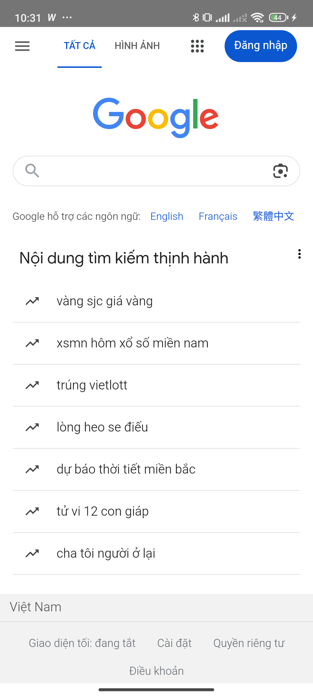
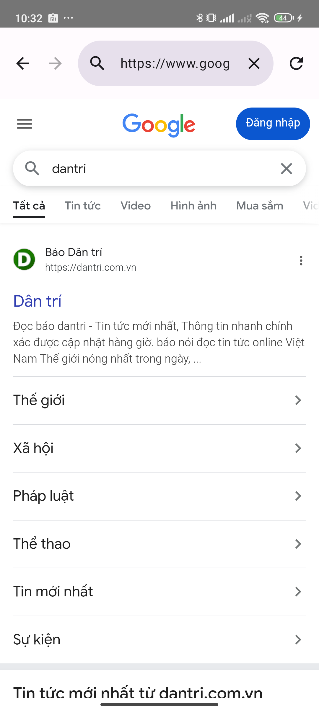

# Android WebView Browser

    
    
    

## Giới thiệu

Một ứng dụng trình duyệt tích hợp đầy đủ các tính năng cơ bản của trình duyệt web.

## Tính năng chính

- Tích hợp WebView
- Hỗ trợ tìm kiếm Google
- Điều hướng Back/Forward
- Tải lại trang
- Tải xuống file và chọn nơi lưu
- Xử lý các loại URL đặc biệt (tel, mailto, maps...)

## Công nghệ sử dụng

- **Jetpack Compose** - Xây dựng UI hiện đại
- **Android WebView** - Hiển thị nội dung web
- **Kotlin Coroutines** - Xử lý bất đồng bộ
- **OkHttp** - Tải xuống file
